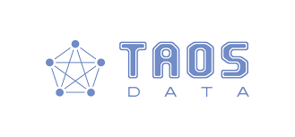
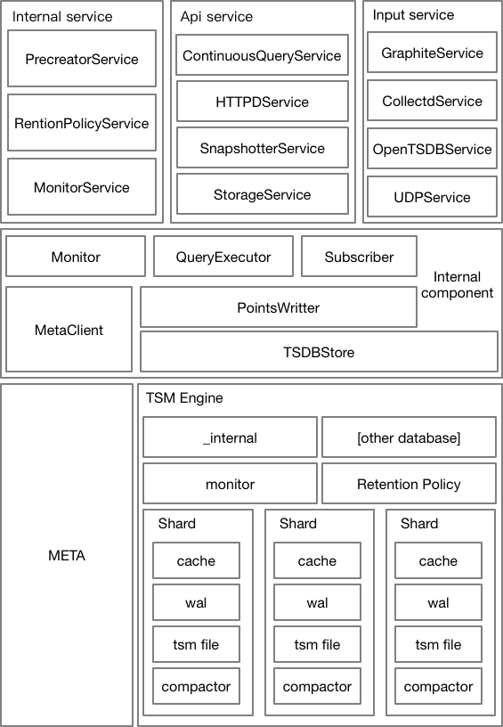

# Time Series Database Selection

## Executive Summary

Now we are looking for a fast, lightly, easy to deployment time sierie database for future usage. By viewing [db-engines.com](https://db-engines.com/en/ranking/time+series+dbms) website and communities and GitHub, we selected 4 time series databases for assesment in this time. They are:

| ||||
|:-:|:-:|:-:|:-:|
|[DolphinDB](https://www.dolphindb.com/)|[InfluxDB](https://www.influxdata.com/)|[KDB+](https://www.kx.com/)|[TDEngine](http://www.taosdata.com/en/)|


We noticed that there are OpenTSDB, TimescaleDB etc,. Most of them base on relational database. It not lightly and easy to deployment.For testing these database, we downloaded Nasdaq daily stock trading summary (time: 2011.01.01~2020.09, 3065+ company) as testing data. We evaluate database by data importing, operationing, query time and others. 

Besides data, we also considering licensing type, architecture, ecosystem and support for future usage.

### Conclusion

By completed whole evaluation, we can get below facts:

+ All of databases support Docker and kubernetes deployment.
+ DolphinDB has an overwhelming advantage in all of these 4 databases.
+ InfluxDB is schema free.
+ TDEngine and DolphinDB are schema defined database.
+ Best performance is DolphinDB but it under commercial license.


Summaraied above information, we recommended **** database as the best choice.

## Scoping

The testing only focus on these four time series database: DolphinDB, InfluxDB, KDB+, TDEngine. The testing will running on a specific virtual machine environment with same operating system Ubuntu 18.04. 

### Environment

Regarding testing resource, we selected **DSv4** series Virtual Machine. Detail as below:

|Series|vCPU|Memory(GiB)|Temproary Storage(GiB)|Max Disk|IOPS/MBPs)|
|:-|:-|:-|:-|:-|:-|
|Standard_D4s_v3|4|16|32|8|8000/64 (100)|

This kind of Vritual Machine has a good balance of Azure quota and pricing. Azure has deployed a large number of this kind of resources.  All VMs will be running on Premium SSD for best disk performance.

Operating System is **Ubuntu 18.04**. 

### Version of Time Series database

|Database|Version|Comments|
|:-|:-|:-|
|DolphinDB|1.00.24 64-bit||
|InfluxDB|1.8.2 64-bit|Production version,although 2.0 is going to beta.|
|KDB+||To prevent leagal issue, we only use 32-bit version.|
|TDEngine|2.0.3.0 64-bit|


## Data for Testing

The testing data comes from [Yahoo finance](https://finance.yahoo.com/) by Python library [yfinance](https://pypi.org/project/yfinance/). The data which is daily information contains 3086 stock symbols time spans 2011.01. 03~2011.09.02. Total lines are **4467799**.

Data contains below fields:

|Fields|Meaning|
|:-|:-|
|date|The trading date.|
|opening_price|The price at which a security first trades upon the opening of an exchange on a trading day.|
|highest_price|Today's high is the highest price at which a stock traded during the course of the trading day.|
|lowest_price|Today's high is the lowest price at which a stock traded during the course of the trading day.|
|closing_price|It refers to the last price at which a stock trades during a regular trading day.|
|adjusted_closing_price|The price that is quoted at the end of the trading day is the price of the last lot of stock that was traded for the day. This is referred to as the stock's closing price.|
|trade_volume|It is a measure of how much of a given financial asset has traded in a period of time. For stocks, volume is measured in the number of shares traded and, for futures and options, it is based on how many contracts have changed hands.|

One of sample:

```json
"2012-01-05": {
    "date": "2012-01-05",
    "code": "AAPL",
    "name": "Apple Inc. - Common Stock",
    "opening_price": 14.929642677307129,
    "highest_price": 14.948214530944824,
    "lowest_price": 14.738214492797852,
    "closing_price": 14.819643020629883,
    "adjusted_closing_price": 12.90129280090332,
    "trade_volume": 271269600.0
}
```
Total items are **5205952**. Different databases require different data formats. Data has to be changed into different format to compatiable data importing. 


## Licensing Considerations

**DolphinDB** has two kind of license for community and enterprise.  In Community Edition, there are many limitations:

+ Not for commercial use
+ Up to 2 nodes with 2 cores and 4GB RAM per node

Community Edition not for huge dataset. Because dolphinDB needs more memory during querying and calculating for optimizing. Memory limitmation will be bottleneck for huge data operating.

Enterprise Edition：
+ Payment required, price unknown. Because to get pricing have to contact sales.
+ No resource limitation.

**InfluxDB** has three edtions: InfluxDB cloud, InfluxDB open source, InfluxDB Enterprise. InfluxDB cloud encapsulates influxDB Enterprise make a PaaS service to users. Enterprise edition has full features. Open source endition will not offer cluster feature since v0.13. 

Since v1.0, cluster will be a feature plugin. Some community contributor created cluster feature and merged into fork. But seems not well tested.

The open source version anncounced [MIT License](https://github.com/influxdata/influxdb/blob/master/LICENSE). It means that anyone can legally copy, modify, merge, publish, distribute, sublicense, and/or sell copies. 

**KDB+** is a commerical software in finTech field. KDB+ has academic, 32bit Personal Version, 64bit Personal Version, Non-Expiring Cores, Subscription cores, On Demand and OEM 7 editions. Only academic, 32bit Personal Version, 64bit Personal Version are free. The 64bit Personal Version requires always connect to KDB+ for submit information to keep license alive. All free edition are not allowed use in business scenarios.

**TDEngine** has three editions: Community Edition, Enterprise Edition, Cloud Edition. Community Edition is free without commercial usage limitation. Community Edition is under [GNU Affero General Public License v3.0](https://github.com/taosdata/TDengine/blob/develop/LICENSE). Anyone can legally (1) assert copyright on the software, and (2) offer this License which gives you legal permission to copy, distribute and/or modify the software.

### Summary

Here is ranking of software license agreement friendliness:

1. InfluxDB(Can do anything, user can decide open source or not.) 
2. TDEngine(Can do anything, user has to open source.) 
3. DolphinDB & KDB+(Commerical software, not open source, user has to by license.)

DolphinDB and KDB+ are not allow free version running in business scenarios. KDB+ requries to collect usage data to keep license alive.


## Architecture Overview

Since DolphinDB and KDB+ are not open source software, they does not expose any architecture information. In this section will only discuss InfluxDB and TDengine.

### InfluxDB



InfluxDB can be divided into data persistence layer, internal component layer, and external service layer. Let's analyze it from the lowest layer to the upper layer. In terms of storage, Influxdb is divided into two types of storage, one is META storage, and the other is data storage. First, let’s check the directory structure on the disk.

META storage will generate a meta.db file in the data directory, which mainly stores the meta information of Influxdb, such as the name of the created database, the retention policy of the database, and so on. Data storage is mainly divided into two types, one is persistent data and the other is pre-written logs. Students who are familiar with storage systems are not unfamiliar with this synchronous pre-write and asynchronous flashing method. This method can be very good. Solve the problems of distributed data storage synchronization and write reliability. The data in the data and wal directories are stored through TSM Engine. The name of the second-level directory is the name of the database, the name of the third-level directory is the name of the retention policy, the fourth-level directory is the id of the shard, and the next level It is the actual stored data file. In addition, careful students will find that the directory structure of wal is exactly the same as the directory structure of data, including the file name. This is because the smallest logical storage unit entity in the TSM Engine is the Shard, and the Shard will build data and data according to its own configuration. wal, so they have the same directory structure.

The internal component layer is the encapsulation of the underlying components in Influxdb. For example, all scenarios that need to manipulate meta information will reference MetaClient, scenarios that need to write data will reference PointsWritter by default, and scenarios that require data query will reference QueryExecutor, etc. These internal components Will be referenced by the upper Service, so we won't go into details about these internal components.

### TDengine

There are two main modules in TDengine server as shown in Picture 1: Management Module (MGMT) and Data Module(DNODE). The whole TDengine architecture also includes a TDengine Client Module.


**MGMT Module**

The MGMT module deals with the storage and querying on metadata, which includes information about users, databases, and tables. Applications will connect to the MGMT module at first when connecting the TDengine server. When creating/dropping databases/tables, The request is sent to the MGMT module at first to create/delete metadata. Then the MGMT module will send requests to the data module to allocate/free resources required. In the case of writing or querying, applications still need to visit the MGMT module to get meta data, according to which, then access the DNODE module.

**DNODE Module**

The DNODE module is responsible for storing and querying data. For the sake of future scaling and high-efficient resource usage, TDengine applies virtualization on resources it uses. TDengine introduces the concept of a virtual node (vnode), which is the unit of storage, resource allocation and data replication (enterprise edition). As is shown in Picture 2, TDengine treats each data node as an aggregation of vnodes.

When a DB is created, the system will allocate a vnode. Each vnode contains multiple tables, but a table belongs to only one vnode. Each DB has one or mode vnodes, but one vnode belongs to only one DB. Each vnode contains all the data in a set of tables. Vnodes have their own cache and directory to store data. Resources between different vnodes are exclusive with each other, no matter cache or file directory. However, resources in the same vnode are shared between all the tables in it. Through virtualization, TDengine can distribute resources reasonably to each vnode and improve resource usage and concurrency. The number of vnodes on a dnode is configurable according to its hardware resources.

**Writing Process**

TDengine uses the Writing Ahead Log strategy to assure data security and integrity. Data received from the client is written to the commit log at first. When TDengine recovers from crashes caused by power loss or other situations, the commit log is used to recover data. After writting to the commit log, data will be wrtten to the corresponding vnode cache, then an acknowledgment is sent to the application. There are two mechanisms that can flush data in cache to disk for persistent storage:


Flush driven by timer: There is a backend timer which flushes data in cache periodically to disks. The period is configurable via parameter commitTime in system configuration file taos.cfg.
Flush driven by data: Data in the cache is also flushed to disks when the left buffer size is below a threshold. Flush driven by data can reset the timer of flush driven by the timer.


## Performance Considerations


### Data Import Performance

In this part of evaluation, we will import all of Nasdaq data into one data table and get data of spent time. Since each data base requires its own data format, the downloaded data has to change format to adapt database. We won't calculate time of data preparation. It only focus on data importing process time.

The result is DolphinDB got the best record that about spent 2.0s to import all of data.
TDEngine almost spent 20 seconds to complete import. 

The poorest one is InfluxDB with Telegrah, more than 10 hours.


For importing details, please view below:

+ [Import data into DolphinDB](./import_data_into_DolphinDB.md)
+ [Import data into InfluxDB](./import_data_into_InfluxDB.md)
+ [Import data into KDB+]()
+ [Import data into TDEngine](./import_data_into_TDEngine.md)

### Query Performance

By tesing serval SQL statments, We got the rank for query performance:

1. DolphinDB
2. TDEngine
3. InfluxDB

DolphinDB always complete query in several milliseconds. TTDEngine usually takes 100 times longer to complete the query than dolphinDB. InfluxDB it the slowest.

For details, please view: [Query Performance](./QueryPerformance.md).

## Support and Community

+ [DolphinDB documentation](https://www.dolphindb.cn/cn/help/index.html)
+ [KDB+](https://code.kx.com/q/)
+ [InfluxDB](https://www.docs.influxdata.com/influxdb/v1.8)
+ [TDEngine](https://www.taosdata.com/cn/documentation/)

Notes:

***

+ InfluxDb has a poor interactive experience. for example: if you select wrong column name that not in the measurement, it won't tell you anything about it. Just return prompt without any meesage.
+ There are a lot of difference between english version and chinese version in DolphinDB documents.
***
