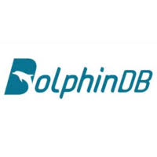

# Time Series Selection

## Executive Summary

By viewing [db-engines.com](https://db-engines.com/en/ranking/time+series+dbms) website and communities and GitHub, we selected 4 time series databases for assesment in this time. They are:

| ||||
|:-:|:-:|:-:|:-:|
|DolphinDB|InfluxDB|KDB+|TDEngine|

For testing these database, we downloaded Nasdaq daily stock trading summary (from 2011.01.01~2020.09, 3000+ company) as testing data. We evaluate database by data importing, operationing, query time and others. 

Besides data, we also considering licensing type, architecture, ecosystem and support for future usage.

### Consolidations

By completed whole evaluation, we can get below facts:

+ All of databases support Docker and kubernetes deployment.
+ KDB+ 
+ InfluxDB
+ TDEngine
+ DolphinDB
+ Best performance is

Summaraied above information, we recommended **TDEngine** database as the best choice.

## Scoping

## Data for Testing

The testing data comes from [Yahoo finance](https://finance.yahoo.com/) by Python library [yfinance](https://pypi.org/project/yfinance/). The data which is daily information contains 3086 stock symbols time spans 2011.01. 03~2011.09.02. Total lines are **4467799**.

Data contains below fields:

|Fields|Comments|
|:-|:-|
|date|The trading date.|
|opening price||
|closing price||

## Licensing Considerations

**DolphinDB** has two kind of license for community and enterprise.  In Community Edition, there are many limitations:

+ Not for commercial use
+ Up to 2 nodes with 2 cores and 4GB RAM per node

Community Edition not for huge dataset. Because dolphinDB needs more memory during querying and calculating for optimizing. Memory limitmation will be bottleneck for huge data operating.

Enterprise Edition：
+ Payment required, price unknown. Because to get pricing have to contact sales.
+ No resource limitation.

**InfluxDB** has three edtions: InfluxDB cloud, InfluxDB open source, InfluxDB Enterprise. InfluxDB cloud encapsulates influxDB Enterprise make a PaaS service to users. Enterprise edition has full features. Open source endition will not offer cluster feature since v0.13. 

Since v1.0, cluster will be a feature plugin. Some community contributor created cluster feature and merged into fork. But seems not well tested.

The open source version anncounced [MIT License](https://github.com/influxdata/influxdb/blob/master/LICENSE). It means that anyone can legally copy, modify, merge, publish, distribute, sublicense, and/or sell copies. 

**KDB+** is a commerical software in finTech field. KDB+ has academic, 32bit Personal Version, 64bit Personal Version, Non-Expiring Cores, Subscription cores, On Demand and OEM 7 editions. Only academic, 32bit Personal Version, 64bit Personal Version are free. The 64bit Personal Version requires always connect to KDB+ for submit information to keep license alive. All free edition are not allowed use in business scenarios.

**TDEngine** has three editions: Community Edition, Enterprise Edition, Cloud Edition. Community Edition is free without commercial usage limitation. Community Edition is under [GNU Affero General Public License v3.0](https://github.com/taosdata/TDengine/blob/develop/LICENSE). Anyone can legally (1) assert copyright on the software, and (2) offer this License which gives you legal permission to copy, distribute and/or modify the software.

### Summary

Here is ranking of software license agreement friendliness:

InfluxDB(Can do anything, user can decide open source or not.) > TDEngine(Can do anything, user has to open source.) > DolphinDB & KDB+(Not open source, user has to by license.)

DolphinDB and KDB+ are not allow free version running in business scenarios. KDB+ needs to collect usage data to keep license alive.

## Architecture

## Performance Considerations

Performance Considerations,

## Support and Community Considerations

