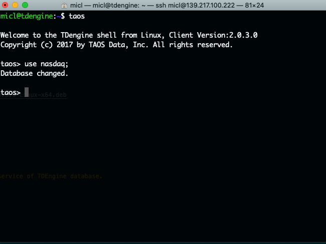

# Install TDEngine database on Ubuntu 18.04

In this document, you will learn how to install TDEngine database on Ubuntu 18.04

# Manually Installation

1. The installation package of TDengine is very small(2.7MB~4.5MB). To get intall pacakge, you need to input a valid email address at below links:

https://www.taosdata.com/en/getting-started/ 
+ TDengine-server-2.0.3.0-Linux-x64.rpm (4.2M)
+ TDengine-server-2.0.3.0-Linux-x64.deb (2.7M)
+ TDengine-server-2.0.3.0-Linux-x64.tar.gz (4.5M)

The download link will appear in your **junk mail folder**.

2. Login Ubuntu server, and download package into local folder.

```shell
mkdir TDEngine
cd TDEngine
wget https://dxact.blob.core.chinacloudapi.cn/21mfilms/TDengine-server-2.0.3.0-Linux-x64.deb
```

3. Manually run install action by dpkg command.

```shell
sudo dpkg -i TDengine-server-2.0.3.0-Linux-64.deb
```

4. Make sure taosd service has been maintained by systemd. taosd is core service of TDEngine database.
   
```shell
sudo systemctl enable --now taosd
```

5. TDEngine supports command line interaction by taos



